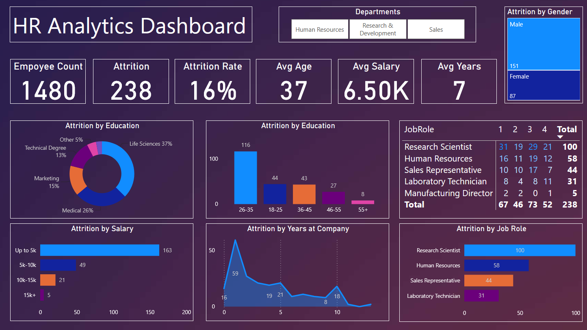
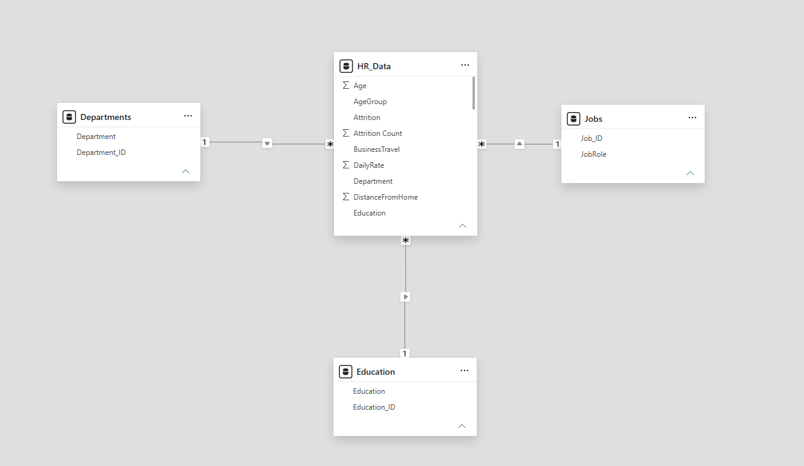

# 📊 [Project Title: e.g., Global Supply Chain & Logistics Performance Dashboard]

---

## 🔗 Live Interactive Project
🚀 **[Click Here to Interact with the Live Dashboard](https://app.powerbi.com/view?r=eyJrIjoiZGI2ZjdhNDMtNWVjYy00OTRjLThiN2EtZjNlZGNmZTc2NmZiIiwidCI6IjZmMTcyNWJhLTQxOGUtNGY0Yy1hNjc1LWNhOTkyMTM2Zjg4MyJ9)**

---

## 🎯 Project Overview
This is a sample PowerBI project created utilizing HR data provided by my PowerBI Certification course. The primary purpose of this dashboard is to visualize and display trends with employee retention & attrition between departments, age, education, etc.

## 📷 Dashboard Preview


---

## 🛠️ Tech Stack & Skills Showcased
* **Data Transformation (ETL):** Utilized Power Query (M) to clean mismatched Excel/CSV sheets and handle null tracking codes.
* **Data Modeling:** Implemented a pure **Star Schema** architecture consisting of 1 Fact table and 3 Dimension tables (HR_Data, Departments, Education, Jobs).

## 📐 Data Architecture (Model View)


---

## 📁 Repository Structure
```text
├── Data/                 # Data source files (Excel)
├── Images/               # Variouses images of dashboard and data model.
├── Sales_Dashboard.pbip  # Power BI Project Folder (Git-tracked metadata)
└── README.md             # This file
```
